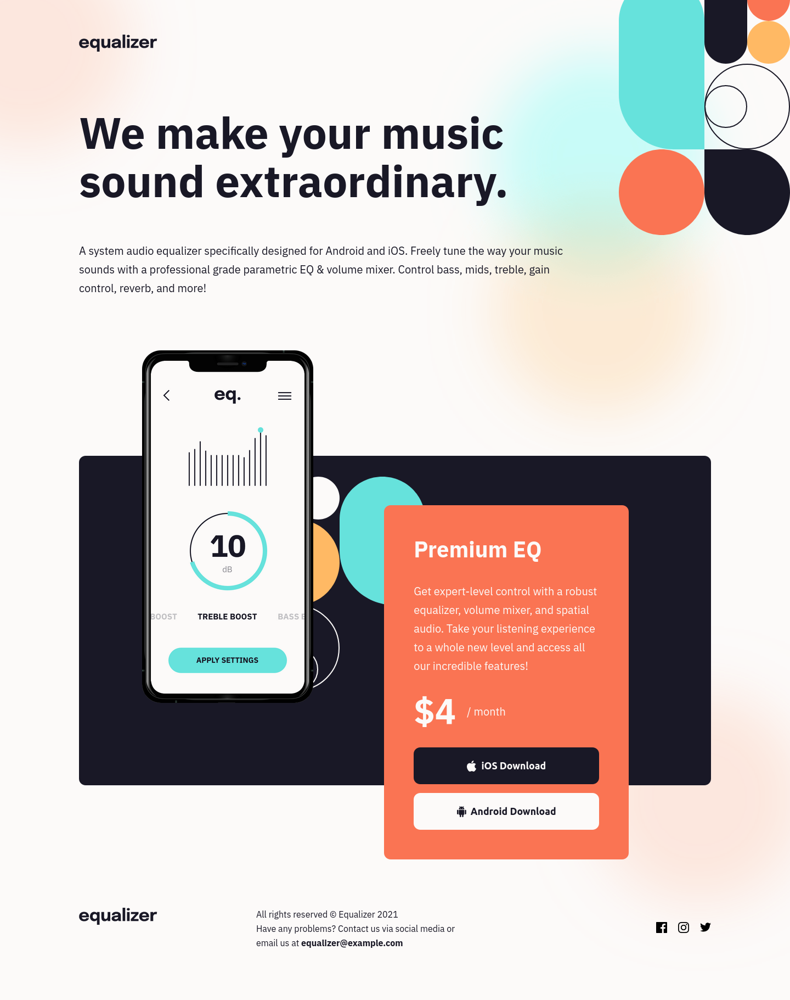

# Frontend Mentor - Equalizer Landing Page solution

This is a solution to the Equalizer Landing Page challenge on [Frontend Mentor](https://www.frontendmentor.io/).

## Table of contents

- [Overview](#overview)
	- [Screenshot](#screenshot)
	- [Links](#links)
- [My process](#my-process)
	- [Built with](#built-with)
	- [What I learned](#what-i-learned)
	- [Questions to community](#questions-to-community)
- [Author](#author)

## Overview

### Screenshot



### Links

- Solution URL: [GitHub - OignonFugace/FEM__equalizer-landing-page](https://github.com/OignonFugace/FEM__equalizer-landing-page)
- Live Site URL: [Frontend Mentor | Equalizer landing page](https://oignonfugace.github.io/FEM__equalizer-landing-page/)

## My process

### Built with
- Vanilla HTML & CCS.


### What I learned
- The challenge is great for practicing positioning and sizing backgrounds images. CSS Tricks articles on the subject were a great help. 
	- [background | CSS-Tricks - CSS-Tricks](https://css-tricks.com/almanac/properties/b/background/)
	- [background-position | CSS-Tricks - CSS-Tricks](https://css-tricks.com/almanac/properties/b/background-position/)
	- [background-size | CSS-Tricks - CSS-Tricks](https://css-tricks.com/almanac/properties/b/background-size/)
- Getting the different layouts on different viewport sizes right was quite challenging. In the end I came out with a global `.site-wrapper` class in order to make the site no wider than 1440px and to make the bg-pattern-1.svg staying in that wrapper, as well as a `.content-wrapper` class that allows me to adapt the margins on different viewport sizes. However, I needed to pass through that `.content-wrapper` on the mobile view for the product section. That has been done with this trick I read about somewhere : 
```css
.product-section {
	margin: 0 calc((100% - 100vw)/2);
}
```
- I did try to put into practice accessibility advices I received as feedbacks on previous challenges.


### Questions to community
- In a feedback on a previous challenge, I was recommended to add the `focusable` HTML attribute to false along with `aria-hidden='false'`. While trying to implement that in this challenge, I read that the `focusable` HTML attribute is not well supported by all browsers and the use of javascript is recommended. Is there a best practice here ? 
- Any feedback are appreciated, especially on the layout strategy or better ones that I could have thought of. 
Thank you all!


## Author
- Website - [Oignon Fugace - par Tanguy Freycon](https://oignonfugace.com/)
- Frontend Mentor - [@OignonFugace](https://www.frontendmentor.io/profile/OignonFugace)
